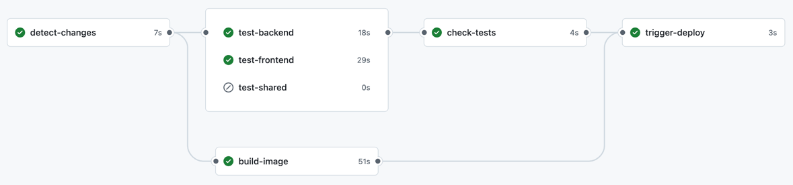

# Guess the Word Together

A tech demo of modern React SPA setup in the form of a collaborative word guessing game. Players work together to guess 
a secret word chosen by AI. Players can see each other typing in real-time and ask yes/no questions to narrow down the possibilities.

**[Play the live demo here](https://guess-the-word-together.onrender.com/)**.

## 🛠️ Tech Stack


### Points of interest
Dependency management:
- Using buns `catalog` to unify dev dependency versions (such as typescript) across all packages 
- Using `linkWorkspacePackages = true` to symlink local packages in monorepo to speedup and simplify development

CI pipeline:


- App is built as a single Docker image running a Koa server on Bun, which serves both frontend and backend
- Fast package installation, build and tests thanks to the Bun + Vite + Vitest combo
- For maximum speed, checks and build runs in parallel, deploy is triggered if everything passes
- Note: For better scaling & availability, static assets could be uploaded to CDN and served from there instead 
  of being part of the docker container

The Internal `shared` package:
- The `shared` package is a pure typescript package with no transpilation step, intended primarily  
  for sharing types between frontend and backend.
- This approach is also known as ["just-in-time" package](https://turborepo.com/docs/core-concepts/internal-packages), because the transpilation
  from typescript is delegated to the consuming packages (frontend and backend).
- Currently it's main use is to define a [typesafe websocket protocol](packages/shared/src/types/socketIoEvents.ts) between frontend and backend.

### More on the technical choices

Building, running, and testing:
- **[Bun](https://bun.com/)** as package manager for monorepo, server runtime and test runtime
  - package manager alternatives: pnpm, nx, turborepo
  - server runtime alternatives: node.js, deno
  - why bun: 
    - by far the fastest package manager compared to all alternatives
    - also the fastest server runtime
    - built-in TypeScript support
    - compared to deno: 
        - better compatibility with npm packages
        - better performance
- **[Vite](https://vite.dev/)** as bundler and dev server for frontend
  - alternatives: bun, webpack, rollup, esbuild, parcel
  - why vite:
    - fast hot module replacement
    - more feature-complete for React applications then bun
    - can use bun as runtime (`bunx --bun vite`) for even faster builds
- **[Vitest](https://vitest.dev/)** as unit test runner
  - alternatives: jest, bun
  - with [React Testing Library](https://testing-library.com/docs/react-testing-library/intro/) as industry standard way to test React components
  - with [happy-dom](https://github.com/capricorn86/happy-dom) as a much faster alternative to JSDOM
  - why vitest:
    - much faster for larger projects compared to jest
    - easy to use with Vite
    - jest-like API
    - more feature-complete than bun test runner
- **[GitHub Actions](https://github.com/features/actions)** for CI/CD

Libraries and frameworks:
- **[Koa](https://koajs.com/)** as web server framework
  - alternatives: express, fastify, bun built-in server
  - why Koa:
    - modern async/await syntax and better performance compared to express
  - why Express:
    - the most mature ecosystem with many middleware options
  - why Fastify:
    - built-in schema validation and serialization
- **[Socket.io](https://socket.io/)** for real-time communication
  - alternatives: Pusher, Yjs, REST+SSE, WebRTC, Ably Pub/Sub
  - why socket.io:
    - mature ecosystem with many features out of the box
    - supports fallbacks to long-polling
    - easy to use with Yjs for real-time collaboration
- **[Yjs](https://docs.yjs.dev/)** for real-time collaborative features
- **[Tailwind](https://tailwindcss.com/)** for styling
  - alternatives: styled-components, emotion, CSS modules
  - why Tailwind:
    - ruthlessly efficient for rapid UI development
    - but best to replace with proper UI framework for larger applications
    
- **React Context** for state management
  - alternatives: Redux, Zustand, MobX
  - why React Context:
    - simple and lightweight for smaller applications
    - no additional dependencies

## How to Run

Requires:
- **Bun** v1.0+
- **Generative AI Provider**: You can either connect to OpenAI API (model `gpt-4o-mini`), or to a locally running AI model using [Ollama](https://ollama.com/) (model `llama3.2:3b`).

### Option 1: Using OpenAI API
```bash
  # Get your OpenAI API key from https://platform.openai.com/api-keys
  # Set environment variables (or place in a `.env` file in packages/backend)
  export AI_MODEL=openai
  export OPENAI_API_KEY=your-api-key-here

  # Install all dependencies
  bun install

  # Start both frontend and backend servers
  bun run dev
```

### Option 2: Using Local AI model
```bash
  # Install and setup Ollama (macOS)
  brew install ollama
  ollama serve &
  ollama pull llama3.2:3b

  # Set environment variables (or place in a `.env` file in packages/backend)
  export AI_MODEL=ollama

  # Install all dependencies
  bun install

  # Start both frontend and backend servers
  bun run dev
```


## TODOs
- Evaluate Yjs or other libraries for real-time collaboration?
- Test out code splitting & lazy loading
- Investigate ways to track test runtime duration, coverage, bundle size and similar metrics over time
- Tagging & versioning releases
